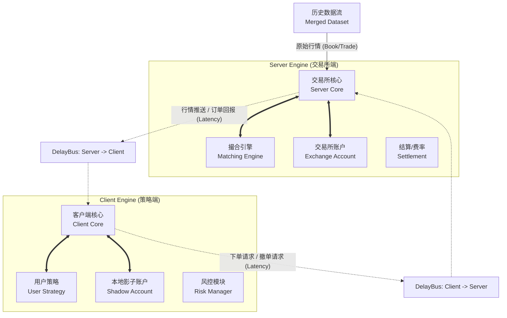

# HftBacktest

**HftBacktest** 是一个专为高频交易（HFT）设计的高性能、事件驱动回测框架。

它采用 **Python + Cython/C++** 的混合架构，在保持策略开发灵活性的同时，利用底层编译代码极大地提升了事件循环、订单撮合及数据回放的性能。框架核心致力于解决高频回测中的痛点：**真实的网络延迟模拟**、**微观结构下的订单排队**以及**高吞吐量的历史数据回放**。

---

## ✨ 核心特性 (Key Features)

* **⚡ 极致性能 (High Performance)**:
    * 核心组件（事件引擎、订单管理、数据读取）均使用 **Cython** 和 **C++** 编写，大幅降低 Python GIL 带来的开销。
    * 支持 **Parquet** 格式数据的高效流式读取，能够轻松处理 TB 级别的 Tick/Depth 数据。
    * 核心事件对象（Event）经过内存布局优化，减少 GC 压力。

* **🕸️ 真实的延迟模拟 (Realistic Latency)**:
    * 独创的 **双引擎架构 (Dual-Engine Architecture)**：将“本地策略端”与“交易所服务端”逻辑严格物理隔离。
    * **DelayBus (延迟总线)**：在两端之间建立带有延迟的传输通道。支持模拟 **网络传输延迟 (One-way Latency)**，精确还原行情推送滞后（Server->Client）和订单回报滞后（Server->Client）以及下单请求滞后（Client->Server）的真实异步场景。

* **📊 微观结构仿真 (Microstructure Simulation)**:
    * 内置高精度的 **本地撮合引擎 (Matching Engine)**，支持通过订单流（Trades）和盘口数据（BookTicker/Depth）估算限价单在 OrderBook 中的 **排队位置 (Queue Position)**。
    * 提供 **Binance** 和 **OKX** 等主流交易所的特定规则适配（如不同的费率模型、订单类型）。

* **🧩 组件化设计 (Component-Based)**:
    * 系统高度解耦，策略、账户、撮合器、风控模块均作为独立组件（Component）接入事件总线。
    * 支持自定义数据源（Dataset）和因子计算模块（Factor）。

---

## 🏗️ 系统架构 (Architecture)

HftBacktest 模拟了真实的物理交易链路。整个回测环境由两个独立的事件循环（Event Loop）组成，中间通过延迟总线连接。



---

## 📚 文档导航（建议阅读顺序）

这份 README 以“能用 → 能改 → 能研究”的顺序组织内容。

### 第一阶段：让读者能用

1) [**快速开始**](#quick-start)：跑通一个 OKX 端到端回测（数据 → 双引擎 → 双 DelayBus → 撮合/账户/策略）。
2) [**核心概念**](#core-concepts)：理解 `Event`/`EventEngine`/`DelayBus`/`Order`/`Component` 的语义与边界。
3) [**Core 文件导览**](#core-files)：按文件快速理解内核职责边界（`hft_backtest/`）。
4) [**OKX 数据 schema**](#okx-schema)：ArrayReader 期望列、字段单位与约定。
5) [**数据准备**](#data-prep)：Event 模式 vs Batch+ArrayReader 模式。

### 第二阶段：让读者能改

6) [**扩展指南**](#extensions)：自定义延迟模型、Component、事件与 Reader。
7) **新交易所适配清单**：要实现哪些 `Event/Matcher/Account/Reader`，如何接到双引擎链路。

### 第三阶段：让读者能研究

8) [**研究闭环**](#research)：因子采样、标签、评估报告。
9) [**性能与故障排查**](#troubleshooting)：构建、版本、热点路径、常见坑。

### 建议从这些文件开始读（从“概念”到“实现”）

- 事件与时间：
    - `Event`：[hft_backtest/event.pyx](hft_backtest/event.pyx)
    - `Timer`：[hft_backtest/timer.pyx](hft_backtest/timer.pyx)
    - 派发器：`EventEngine`：[hft_backtest/event_engine.pyx](hft_backtest/event_engine.pyx)
- 回测主循环：`BacktestEngine`：[hft_backtest/backtest.pyx](hft_backtest/backtest.pyx)
- “网线”与延迟：`DelayBus/LatencyModel`：[hft_backtest/delaybus.pyx](hft_backtest/delaybus.pyx)
- 订单协议：`Order`：[hft_backtest/order.pyx](hft_backtest/order.pyx)
- Component 与工具：
    - 基类：`Strategy`：[hft_backtest/strategy.py](hft_backtest/strategy.py)
    - 打印/追踪：[hft_backtest/helper.py](hft_backtest/helper.py)
    - 记录器：[hft_backtest/recorder.py](hft_backtest/recorder.py)
- OKX 适配：
    - 事件 schema：[hft_backtest/okx/event.pyx](hft_backtest/okx/event.pyx)
    - 高性能 Reader：[hft_backtest/okx/reader.pyx](hft_backtest/okx/reader.pyx)
    - 撮合器：[hft_backtest/okx/matcher.pyx](hft_backtest/okx/matcher.pyx)
    - 账户结算：[hft_backtest/okx/account.pyx](hft_backtest/okx/account.pyx)
    - 因子评估（可选）：[hft_backtest/okx/factor_evaluator.pyx](hft_backtest/okx/factor_evaluator.pyx)

---

## 🚀 安装指南 (Installation)

由于本项目包含大量 Cython/C++ 扩展代码，建议使用本地编译安装。

### 1. 环境准备 (Prerequisites)

- **OS**: Linux (推荐) / Windows / MacOS
- **Python**: 建议 **3.8 - 3.10**（对 Cython 扩展最稳）。
- **Python 3.11+ 说明**：不同平台/编译器/Cython 版本差异较大。
    - 本仓库在 **Linux + Python 3.13** 下已能完成 `pip install -e .`、`python setup.py build_ext --inplace` 并跑通 Quick Start（截至 2026-01-16）。
    - 但不做“所有环境都能过”的兼容性承诺；如果你遇到编译/运行问题，优先切回 Python 3.10。
- **Compiler**:
    - Linux/MacOS: GCC 或 Clang
    - Windows: Microsoft Visual C++ 14.0+ (Build Tools)

### 2. 安装依赖与开发安装

```bash
pip install -U pip setuptools wheel
pip install -e .
```

### 3. 编译扩展 (Build Extensions)

```bash
python setup.py build_ext --inplace
```

### 4. (可选) 调试模式编译

```bash
# Linux/Mac
HFT_DEBUG=1 python setup.py build_ext --inplace

# Windows (PowerShell)
$env:HFT_DEBUG="1"; python setup.py build_ext --inplace
```

---

<a id="quick-start"></a>
## ⚡ 快速开始 (Quick Start)

### 1. 运行最小示例

为了让您快速上手，我们提供了一个最小化的 Demo。请在项目根目录下创建一个名为 `demo.py` 的文件。

**注意**：此 Demo 会在本地生成两份 Parquet（`./data/trades.parquet` 与 `./data/bookTicker.parquet`），无需外部数据；如果你要接入真实数据，请看下方“数据准备”。

**重要（避免误覆盖）**：如果你本地已经有同名文件，这个 demo 会直接覆盖它们。建议：

- 把 demo 输出目录改成 `./data/demo/`；或
- 先备份原文件；或
- 运行完按下方“清理”把 demo 生成物删掉。

```python
# demo.py
import time
import os
import pandas as pd
import pyarrow as pa
import pyarrow.parquet as pq

from hft_backtest import (
    BacktestEngine, 
    MergedDataset, 
    ParquetDataset, 
    Strategy, 
    Order,
)
from hft_backtest.delaybus import DelayBus, FixedDelayModel
# 使用 OKX 组件（建议直接从子模块导入，避免 __init__ 暴露不全）
from hft_backtest.okx.account import OKXAccount
from hft_backtest.okx.matcher import OKXMatcher
from hft_backtest.okx.reader import OKXBooktickerArrayReader, OKXTradesArrayReader
from hft_backtest.okx.event import OKXBookticker

# ==============================================================================
# 0. 数据生成工具 (仅用于 Demo，无需外部文件)
# ==============================================================================
def generate_dummy_data():
    """生成测试用的 parquet 数据文件"""
    if not os.path.exists("./data"):
        os.makedirs("./data")
    
    # 1. 生成 OKX Trades 数据 (100条)
    # OKXTradesArrayReader 期望字段：created_time/trade_id/price/size/instrument_name/side
    trades_df = pd.DataFrame({
        'created_time': range(1000, 101000, 1000), # 时间单位示例：us
        'trade_id': range(1, 101),
        'price': [50000.0 + i * 0.1 for i in range(100)],
        'size': 0.1,
        'instrument_name': 'BTC-USDT',
        'side': 'buy',
    })
    # 转换为 Parquet (禁用索引)
    pq.write_table(pa.Table.from_pandas(trades_df, preserve_index=False), "./data/trades.parquet")

    # 2. 生成 OKX BookTicker 数据 (100条)
    # OKXBooktickerArrayReader 期望字段：timestamp/symbol/(local_timestamp 可选) + ask/bid 1..25 档
    ticker_df = pd.DataFrame({
        'timestamp': range(1000, 101000, 1000),
        'symbol': 'BTC-USDT',
        'local_timestamp': range(1000, 101000, 1000),
        'bid_price_1': [49999.0 + i * 0.1 for i in range(100)],
        'bid_amount_1': 1.0,
        'ask_price_1': [50001.0 + i * 0.1 for i in range(100)],
        'ask_amount_1': 1.0,
    })
    pq.write_table(pa.Table.from_pandas(ticker_df, preserve_index=False), "./data/bookTicker.parquet")
    print("[Demo] Dummy parquet files generated in ./data/")

# ==============================================================================
# 1. 策略定义
# ==============================================================================
class HelloworldStrategy(Strategy):
    def __init__(self, account):
        # 必须调用父类初始化并传入账户对象
        super().__init__(account)
        self.sent = False

    def start(self, engine):
        # 如果重写了 start，必须调用父类 start 以绑定 event_engine
        super().start(engine)
        # 订阅你关心的行情事件
        engine.register(OKXBookticker, self.on_bookticker)
        print("[Strategy] Engine attached.")

    def on_bookticker(self, event: OKXBookticker):
        # 简单的触发逻辑：收到第一条盘口后发送一个限价单
        if not self.sent:
            print(f"[Strategy] Bookticker received: {event.symbol} ts={event.timestamp}")
            
            # 使用工厂方法创建订单：方向由 quantity 正负决定（+买 / -卖）
            order = Order.create_limit(symbol="BTC-USDT", quantity=0.01, price=40000.0)
            
            # 使用父类提供的 send_order 接口
            self.send_order(order)
            self.sent = True
            print("[Strategy] Limit Order Sent!")

# ==============================================================================
# 2. 主程序
# ==============================================================================
if __name__ == "__main__":
    # 生成数据
    generate_dummy_data()

    symbol = "BTC-USDT"
    trades_path = "./data/trades.parquet"
    ticker_path = "./data/bookTicker.parquet"

    # --------------------------------------------------------------------------
    # [A] 数据加载配置 (High Performance Mode)
    # --------------------------------------------------------------------------
    # 1. 定义 Dataset: 开启 mode='batch'，只负责读取 DataFrame，不负责生成 Event。
    #    关键参数：
    #    - chunksize: 控制每批 DataFrame 的行数（太小会导致 Python/Arrow 调度开销变大；太大则占用内存）
    #    - columns: ⚠️ 当前实现下，batch 模式不会自动做 Parquet 列投影裁剪；它更像是“声明你会用到哪些列”。
    #      如果你要真减少 IO/内存，请离线裁剪 Parquet（或自行改造读取路径）。
    trades_ds = ParquetDataset(
        trades_path,
        mode='batch',
        chunksize=200_000,
        columns=['created_time', 'trade_id', 'price', 'size', 'instrument_name', 'side'],
    )
    ticker_ds = ParquetDataset(
        ticker_path,
        mode='batch',
        chunksize=200_000,
        columns=['timestamp', 'symbol', 'local_timestamp', 'bid_price_1', 'bid_amount_1', 'ask_price_1', 'ask_amount_1'],
    )

    # 2. 使用交易所专用 Reader（Cython + numpy 视图）把 DataFrame batch 转成 Event 流
    #    相比 Python 层逐条 yield，这条路径通常更快、更省内存。
    print("[Init] Loading data with OKX ArrayReader accelerator...")

    ticker_reader = OKXBooktickerArrayReader(ticker_ds)
    trades_reader = OKXTradesArrayReader(trades_ds)

    # 3. 合并数据流：多路归并后输出单一按时间排序的 Event 流
    ds = MergedDataset([ticker_reader, trades_reader])

    # --------------------------------------------------------------------------
    # [B] 引擎与延迟总线配置
    # --------------------------------------------------------------------------
    # 1. 定义延迟模型: 模拟 10ms 的固定光纤延迟
    latency_model = FixedDelayModel(delay=10000) # 单位: us (假设系统时间单位为us)

    # 2. 创建双向延迟总线
    #    Server -> Client (行情/回报延迟)
    bus_s2c = DelayBus(latency_model)
    #    Client -> Server (下单/撤单延迟)
    bus_c2s = DelayBus(latency_model)

    # 3. 初始化回测引擎 (传入 C++ 类型的 DelayBus)
    engine = BacktestEngine(
        dataset=ds,
        server2client_delaybus=bus_s2c,
        client2server_delaybus=bus_c2s,
    )

    # --------------------------------------------------------------------------
    # [C] 组件装配
    # --------------------------------------------------------------------------
    # === Server 端 (模拟交易所) ===
    engine.add_component(OKXMatcher(symbol), is_server=True)   # 撮合引擎
    server_acc = OKXAccount(initial_balance=100000.0)
    engine.add_component(server_acc, is_server=True)     # 交易所账户

    # === Client 端 (模拟本地策略) ===
    client_acc = OKXAccount(initial_balance=100000.0)
    engine.add_component(client_acc, is_server=False)    # 本地影子账户
    
    # 策略通常持有 client_account 的引用以查询资金/持仓
    strategy = HelloworldStrategy(client_acc)
    engine.add_component(strategy, is_server=False)      # 用户策略

    # --------------------------------------------------------------------------
    # [D] 运行
    # --------------------------------------------------------------------------
    print("[Run] Start backtest...")
    start_t = time.time()
    engine.run()
    print(f"[Run] Backtest finished in {time.time() - start_t:.4f}s")
```

**清理（强烈建议）**

Quick Start 验证通过后，可以删除临时文件，保持仓库干净：

```bash
rm -f demo.py ./data/trades.parquet ./data/bookTicker.parquet
```

如果你希望在 demo 里看到成交（FILLED），把下单价改成“更容易成交”的价格（例如买单把 price 设到 ask 之上），否则订单可能不会成交但回测依然能跑通。

---

<a id="core-concepts"></a>
## 🧩 核心概念（Event / Engine / Bus / Order / Component）

### 1) Event：框架里“唯一的消息载体”

所有数据、订单、定时器、因子信号最终都是 `Event`（或其子类）。核心字段：

- `timestamp`：事件发生的逻辑时间（排序与时间推进的唯一依据）
- `source`：产生该事件的引擎 id（ServerEngine 或 ClientEngine）
- `producer`：产生该事件的 listener id（用于 `ignore_self` 去自反馈）

`derive()`：用于在延迟传输/跨组件处理时做“快照复制”。`DelayBus` 会对每个要传输的事件做 `derive()`，避免发送方后续修改对象污染延迟队列。

### 2) EventEngine：高性能派发器（单线程事件循环）

`EventEngine` 负责两件事：

1. 维护引擎当前时间 `engine.timestamp`（`put(event)` 时自动推进）
2. 按监听器顺序派发事件（见 [hft_backtest/event_engine.pyx](hft_backtest/event_engine.pyx)）：
     - Senior Global → Specific Type Listeners → Junior Global

两个常用注册接口：

- `engine.register(EventType, callback, ignore_self=True)`：只监听某类事件
- `engine.global_register(callback, ignore_self=False, is_senior=False)`：监听所有事件

`ignore_self` 的语义是：如果当前事件的 `producer` 是自己，就跳过回调，避免“组件 A 收到事件 → 再 put → 又被自己收到”的自触发回路。

### 3) Component：可插拔功能单元

Component 是“扩展机制”的核心：任何想挂进系统的功能都写成 Component。

- 生命周期：`start(engine)` / `stop()`
- 推荐做法：
    - 在 `start()` 里注册回调（`engine.register`/`global_register`）
    - 在回调里读事件、更新内部状态、必要时 `engine.put(new_event)`

策略、撮合器、账户、DelayBus、Recorder、因子采样器本质上都是 Component。

### 4) DelayBus：两套引擎之间的“带延迟网线”

- 只搬运来自某一侧引擎（source id 匹配）的事件
- 对 `event` 做 `derive()` 得到副本 `snapshot`
- 使用 `LatencyModel.get_delay(event)` 计算触发时间 `event.timestamp + delay`
- 到点后把 `snapshot` 推送到目标引擎

### 5) Order：订单协议与状态机

`Order` 是一个高性能 Cython 事件类型（见 [hft_backtest/order.pyx](hft_backtest/order.pyx)）：

- **方向**：由 `quantity` 正负决定（`>0` 买，`<0` 卖）
- **价格/数量整数化**：内部用 `SCALER` 缓存 `price_int/quantity_int`，减少浮点误差与计算开销
- **常用创建方法**：
    - `Order.create_limit(symbol, quantity, price, post_only=False)`
    - `Order.create_market(symbol, quantity)`
    - `Order.create_tracking(symbol, quantity, post_only=True)`（跟踪最优价）
    - `Order.create_cancel(order)`

订单生命周期（典型）：

`CREATED → SUBMITTED → RECEIVED → (FILLED | CANCELED | REJECTED)`

策略发单时会把订单从 `CREATED` 推到 `SUBMITTED`（见 [hft_backtest/strategy.py](hft_backtest/strategy.py)）。

---

<a id="core-files"></a>
## 🧭 Core 文件导览（hft_backtest/ 逐个介绍）

这一节按“读代码的自然顺序”把内核目录下的关键文件逐个过一遍，帮助你建立稳定心智模型。

> 说明：本项目核心代码以 `.pyx/.pxd`（Cython）为主，`.pyi` 是类型提示；你读实现以 `.pyx` 为准。

这一节的目标不是“告诉你有哪些文件”，而是把每个文件里**核心类/协议**讲透：

- 它解决什么问题？
- 在系统链路里处于什么位置？
- 为什么这样设计？
- 你要扩展/替换时，应该从哪里下手？

为了更容易上手，每个文件我都按固定模板讲：

- **你会在里面看到什么**（关键类/关键方法）
- **设计思想**（为什么这样写）
- **怎么扩展**（你要“改成你自己的”要改哪里）
- **怎么用**（最小示例 / 常见用法）
- **常见坑**（读者最容易踩的点）

---

### 1) [hft_backtest/event.pyx](hft_backtest/event.pyx)：事件协议与 `derive()` 快照语义

**你会在里面看到什么**

- `cdef class Event`：框架里几乎所有消息的基类。
- 字段：`timestamp/source/producer`。
- `cpdef Event derive(self)`：复制事件并重置“路由头”。

**设计思想**

- 把“数据/订单/定时器/因子信号”统一为 Event，统一进入 `EventEngine` 的派发链路。
- `timestamp` 是框架内部推进时间与排序的唯一依据（`MergedDataset` 归并、`BacktestEngine` 推进都依赖它）。
- `source/producer` 是“事件路由头”，用于：
    - `DelayBus` 过滤“只搬运某一侧引擎产生的事件”；
    - `ignore_self` 防止组件自触发回路（A put 事件又被 A 收到）。
- `derive()` 是“跨引擎/跨延迟队列”时的**快照复制**机制：避免发送方后续修改对象污染延迟队列。

**怎么扩展**

- 交易所适配的核心事件（例如 `OKXTrades/OKXBookticker`）应当实现为 Cython `cdef class X(Event)`，并**实现自己的 `derive()`**（参考 Timer/Order/FactorSignal 的写法）。
- 如果你尝试用 Python 子类扩展 `Event` 并往 `__dict__` 里挂动态属性：要谨慎。
    - 当前 `Event.derive()` 的实现是 `copy.copy(self)`，并且注释中明确警告：子类的 Python-level `__dict__` 不一定能被安全处理。
    - 实务建议：高频主链路尽量不要依赖动态属性（把字段做成 Cython 定义的属性/成员）。

**怎么用**

- 在策略/组件里通常不需要直接构造 `Event`，而是构造其子类（例如 Order、Timer、交易所事件）。
- 如果你真的需要一个最小事件用于调试，可以这样：

```python
from hft_backtest.event import Event

e = Event(123456789)  # timestamp
```

**常见坑**

- `timestamp <= 0` 的事件在 `EventEngine.put()` 时会被“自动补成当前引擎时间”，这对某些事件是特性（例如 `FactorSignal` 默认 timestamp=0），但对行情/撮合事件一般不是你想要的。

---

### 2) [hft_backtest/event_engine.pyx](hft_backtest/event_engine.pyx)：单线程派发器与 `Component` 生命周期

**你会在里面看到什么**

- `cdef class Component`：组件基类（`start/stop`）。
- `cdef class EventEngine`：
    - `register(event_type, listener, ignore_self=True)`：监听某个事件类型；
    - `global_register(listener, ignore_self=False, is_senior=False)`：监听所有事件；
    - `put(event)`：推送事件并触发 drain；
    - `_drain()`：核心循环；
    - `_call_listener()`：维护 `_current_listener_id` 用于 producer 标记。

**设计思想**

- 单线程事件循环：用“顺序一致性”换“性能与确定性”。
- 三段派发：Senior Global → Specific Type → Junior Global。
    - Senior 适合做“观察/审计/统计”或“必须先发生”的拦截；
    - Junior 适合做“后处理/搬运”（例如 DelayBus 在策略处理后再搬运）。
- `ignore_self` 的实现依赖 `producer`：事件在派发某个 listener 时，会把 `producer` 临时设置为该 listener 的 id。

**怎么扩展**

- 绝大多数扩展不需要改 `EventEngine`，而是写新的 `Component`：
    - 在 `start(engine)` 中注册回调；
    - 在回调中维护状态/put 新事件。
- 如果你需要“保证某个处理一定在所有人之前/之后”：用 `is_senior=True/False` 放到 Global Listener 的前后。

**怎么用（典型写法）**

```python
from hft_backtest.event_engine import Component
from hft_backtest.order import Order

class MyListener(Component):
    def start(self, engine):
    self.engine = engine
    engine.register(Order, self.on_order, ignore_self=True)

    def on_order(self, order: Order):
    # 读取事件、更新状态、必要时再 put 事件
    pass
```

**常见坑**

- `EventEngine` 在派发过程中（`_dispatching=True`）禁止注册新 listener：`register/global_register` 会直接抛异常。
    - 这意味着：动态改订阅要么放在启动前，要么通过“先注册一个总入口 listener，再由入口内部决定是否处理”。

---

### 3) [hft_backtest/timer.pyx](hft_backtest/timer.pyx)：Timer 事件（截面对齐的“节拍器”）

**你会在里面看到什么**

- `cdef class Timer(Event)`：只有 timestamp 路由头，没有额外载荷。
- 手写 `derive()`：绕过 `copy.copy`，直接 `__new__` 分配，性能更好。

**设计思想**

- 高频数据事件密度不均，Timer 让“采样/统计/记录”变成稳定的截面序列。
- Timer 的 `derive()` 语义只重置路由头：延迟总线搬运时，真正的 timestamp 会由 DelayBus 覆盖回去。

**怎么扩展**

- Timer 的扩展通常不是改 Timer 本身，而是：
    - 在 `BacktestEngine(timer_interval=...)` 控制注入频率；
    - 写监听 Timer 的组件（Recorder、Sampler、统计等）。

**怎么用**

- 监听 Timer：

```python
from hft_backtest import Timer

def on_timer(t: Timer):
    pass
```

**常见坑**

- Timer 太密会直接变成“事件风暴”。如果你挂了多个 sampler/recorder，会非常明显。

---

### 4) [hft_backtest/delaybus.pyx](hft_backtest/delaybus.pyx)：跨引擎延迟传输（DelayBus + LatencyModel）

**你会在里面看到什么**

- `LatencyModel.get_delay(event)`：延迟模型抽象。
- `FixedDelayModel(delay)`：固定延迟。
- `DelayBus(Component)`：
    - `start(engine)`：记录 source engine id 并注册 global listener（junior）；
    - `on_event(event)`：过滤 source、`derive()` 快照、按 delay 入堆；
    - `process_until(ts)`：把触发时间 `<= ts` 的事件推给 target engine；
    - `next_timestamp/peek_trigger_time()`：给 `BacktestEngine` 做“最小时间推进”用。

**设计思想**

- 双引擎 + 双 DelayBus 是本框架“物理链路真实性”的核心：
    - S2C：行情/回报延迟；
    - C2S：下单/撤单请求延迟。
- DelayBus 自己不关心事件类型，只关心“来源”“触发时间”“转发”。
- DelayBus 作为 **Junior Global Listener** 注册：保证策略/账户/撮合等“本侧处理”先发生，再把结果跨引擎搬运。

**怎么扩展（延迟模型）**

- 写一个新的 LatencyModel：

```python
from hft_backtest.delaybus import LatencyModel

class MyLatency(LatencyModel):
    def __init__(self, base=1000):
    self.base = base

    def get_delay(self, event):
    # 返回整数时间单位（例如 us）
    return self.base
```

**怎么扩展（更复杂的总线语义）**

- 如果你要模拟：分事件类型的延迟、拥塞、丢包、带宽限制等，通常是扩展 DelayBus 的 `on_event`/队列逻辑。
    - 注意 DelayBus 内部用 C++ vector 做 min-heap，并手动 `INCREF/DECREF` 管理引用，修改时要非常谨慎。

**常见坑**

- `derive()` 的语义：DelayBus 会先 `snapshot = event.derive()`（重置路由头），然后把原事件的 `timestamp/source/producer` 写回 snapshot。
    - 这要求事件的 `derive()` 至少能正确复制“载荷字段”。

---

### 5) [hft_backtest/backtest.pyx](hft_backtest/backtest.pyx)：回测主循环（最小时间推进）

**你会在里面看到什么**

- `BacktestEngine(dataset, server2client_delaybus, client2server_delaybus, timer_interval, start_time, end_time)`
- 两个 `EventEngine`：`server_engine` 与 `client_engine`。
- `add_component(component, is_server)`：把组件挂到某一侧。
- `run()`：
    - 启动组件；
    - 从 dataset 预读，快进到 `start_time`；
    - 在 `t_data/t_s2c/t_c2s/next_timer` 中取最小时间推进；
    - 熔断：超过 `end_time` 直接结束；
    - 收尾：把 delaybus 里剩余事件尽量处理完。

**设计思想**

- 回测推进不是“每个 tick 都跑一堆逻辑”，而是一个明确的离散事件系统：
    - 数据事件（来自 dataset）
    - 两条延迟链路事件（来自两条 DelayBus）
    - Timer（来自引擎注入）
    这四条时间轴中取 `min`，就是下一次要处理的系统时间。

**怎么扩展**

- 绝大多数扩展在“组件层”完成：撮合、账户、策略、采样器、记录器。
- 如果你要做更复杂的时间推进策略（例如优先级、批处理、快进策略），需要改 `run()` 的推进逻辑。

**怎么用（最关键的装配点）**

- 把组件挂在对的一侧：
    - Server：撮合器、交易所账户、交易所侧标签等；
    - Client：策略、影子账户、因子采样器、记录器等。

**常见坑**

- `timer_interval=None` 会禁用 Timer 注入（见 `__init__` 的 `_use_timer` 逻辑）。
- dataset 输出的 event timestamp 必须非递减（至少每个 source 非递减），否则推进会“倒退”。

---

### 6) [hft_backtest/order.pyx](hft_backtest/order.pyx)：订单对象（事件 + 状态机 + 性能缓存）

**你会在里面看到什么**

- `cdef class Order(Event)`：高性能订单事件。
- 枚举：`ORDER_TYPE_*` 与 `ORDER_STATE_*`。
- `price/quantity` 与 `price_int/quantity_int`：通过 `SCALER` 做整数化并缓存。
- 工厂方法：`create_limit/create_market/create_tracking/create_cancel`。
- 手写 `derive()`：避免走 `copy.copy`。

**设计思想**

- 订单既是“策略指令”，也是“撮合与账户状态回报”的载体。
- 用整数化缓存减少浮点误差与重复计算。
- 撤单不是新写一堆字段，而是 `create_cancel(order)` 从原订单 `derive()`，保留 `order_id/symbol` 等关键标识。

**怎么扩展**

- 通常不建议在核心 `Order` 上扩展字段（会牵扯撮合/账户/记录器的兼容）。
- 如果你确实需要“订单携带额外策略元数据”：
    - 推荐把元数据放在策略侧的 dict 中，以 `order_id` 关联；
    - 或者定义你自己的事件类型用于策略内部链路，不走跨引擎延迟。

**怎么用**

```python
from hft_backtest.order import Order

o1 = Order.create_limit("BTC-USDT", quantity=0.01, price=40000.0)
o2 = Order.create_market("BTC-USDT", quantity=-0.01)
o3 = Order.create_cancel(o1)
```

**常见坑**

- `Strategy.send_order` 会把订单状态从 CREATED 改到 SUBMITTED；如果你直接 `engine.put(order)`，状态机语义会乱。

---

### 7) [hft_backtest/matcher.pyx](hft_backtest/matcher.pyx)：撮合引擎抽象（MatchEngine）

**你会在里面看到什么**

- `cdef class MatchEngine(Component)`：撮合器抽象。
- `on_order(self, Order order)`：处理订单事件（抽象方法）。
- `start(self, EventEngine engine)`：要求子类实现（抽象）。

**设计思想**

- 核心层只定义“撮合器必须是什么形状”（契约），具体交易所的撮合规则放在子包（OKX/Binance）。
- 撮合器是 Server 侧的核心组件：它把 Client 的订单请求变成“成交/拒单/撤单”的状态演进。

**怎么扩展**

- 新交易所适配时最关键的文件之一：实现自己的 `XxxMatcher(MatchEngine)`：
    - 在 `start()` 里注册：Order 事件、行情事件（Trade/BookTicker/Depth）；
    - 在回调里更新订单簿/队列估计/成交生成；
    - 撮合到状态变化时，把 `Order`（更新 state/filled_price/traded/fee 等）再 `engine.put(order)`。

---

### 8) [hft_backtest/account.pyx](hft_backtest/account.pyx)：账户抽象（Account 契约）

**你会在里面看到什么**

- `cdef class Account(Component)`：只定义接口，不提供实现。
- 关键方法：
    - `on_order(order)`：接收订单回报并更新资产/仓位；
    - `get_balance/get_equity/get_positions/get_orders/get_prices`：查询接口；
    - `get_total_*`：统计接口（手续费、资金费、成交次数、成交额等）。

**设计思想**

- 把“撮合”与“结算/仓位/费用”分离：
    - Matcher 决定成交；
    - Account 负责把成交变成资金、仓位、费用、PnL。

**怎么扩展**

- 子包实现（例如 `OKXAccount`）必须实现这里所有 `cpdef` 方法。
- 推荐：
    - 在 `start(engine)` 里注册 `Order` 事件回调；
    - 维护内部 `positions/orders/prices`；
    - 统计量用累计值，方便 Recorder 做差分。

---

### 9) [hft_backtest/dataset.py](hft_backtest/dataset.py)：Dataset（事件流 / 批流）

**你会在里面看到什么**

- `class Dataset(ABC)`：要求实现 `__iter__`。
- `ParquetDataset`：读取 Parquet 并按 batch 产出。
- `CsvDataset`：读取 CSV 并按 chunksize 产出。
- 两种 mode：
    - `mode='event'`：把 DataFrame 列映射成 `Event` 流；
    - `mode='batch'`：直接 yield DataFrame（作为 ArrayReader 的原材料）。
- `tag_dict`：覆盖/补充 DataFrame 列；
- `transform`：自定义预处理（rename、清洗、单位转换等）。

**设计思想**

- Dataset 只负责“把数据读出来”，不负责撮合/策略。
- Batch 模式是高性能路径：把 Python 层的逐行创建成本搬到 Cython ArrayReader 里。

**怎么扩展**

- 你可以写自己的 Dataset（Kafka/数据库/自定义二进制文件）：只要实现 `__iter__` 并 yield Event 或 DataFrame。

**重要说明：关于 `columns=` 的真实语义（以当前实现为准）**

- 当前 [hft_backtest/dataset.py](hft_backtest/dataset.py) 里：
    - `mode='event'`：`columns` 会被用来从 DataFrame 里取列并构造事件；
    - `mode='batch'`：Dataset 会直接 `df = batch.to_pandas()`，**并不会把 `columns` 传给 Parquet 读取器做投影裁剪**。

这意味着：`columns` 在 batch 模式下更多是一种“约定/声明”，不一定能减少 IO；如果你要真裁剪 IO，需要：

- 离线把 Parquet 写成只包含所需列；或
- 改造 Parquet 读取路径（例如在 iter_batches 侧做列投影；Roadmap 里也提过 Reader/schema 工具会继续演进）。

---

### 10) [hft_backtest/reader.pyx](hft_backtest/reader.pyx)：DataReader（高性能读取接口）与 PyDatasetWrapper（适配器）

**你会在里面看到什么**

- `cdef class DataReader`：Cython 侧统一的“拉取下一条事件”接口：`fetch_next()`。
- `PyDatasetWrapper(DataReader)`：把任意 Python Iterable[Event] 伪装成 DataReader。

**设计思想**

- `BacktestEngine` 与 `MergedDataset` 都希望用 C 接口 `fetch_next()` 拉取事件，避免 Python 迭代协议的开销。
- 但为了兼容性，允许把 Python Dataset 包一层适配器。

**怎么扩展**

- 你要写“真正快”的 Reader：写 Cython `DataReader` 子类，内部一次性把一批数据转成事件并持续 `fetch_next()`。
- OKX 的 `*ArrayReader` 就是这种模式。

---

### 11) [hft_backtest/merged_dataset.pyx](hft_backtest/merged_dataset.pyx)：多路归并与“同 timestamp 稳定顺序”

**你会在里面看到什么**

- `cdef class MergedDataset(DataReader)`：接受多个 source（每个 source 是 DataReader 或 Python Iterable）。
- `fetch_next()`：
    - 初始化：每路预读一条，建一个最小堆；
    - 每次从“当前 source”拉下一条，和堆顶比较后决定谁是下一条全局最小。
- tie-break：timestamp 相同按 `source_idx`（输入 list 顺序）优先。

**设计思想**

- 这是框架的“事件排序器”：把多条事件流合成单一按时间有序的事件流。
- tie-break 不是细枝末节：相同 timestamp 的顺序会影响策略可见信息与撮合演进。

**怎么扩展**

- 如果你需要更复杂的 tie-break（例如按事件类型优先级、按 exchange/stream 权重）：
    - 可以把每个 stream 拆得更细并调整输入顺序；或
    - 自己实现一个带优先级的 MergedDataset（建议先从 Python 版本验证逻辑，再迁移到 Cython）。

---

### 12) [hft_backtest/strategy.py](hft_backtest/strategy.py)：策略基类（最小正确用法）

**你会在里面看到什么**

- `class Strategy(Component)`：策略是一个组件。
- `start(engine)`：绑定 `self.event_engine`。
- `send_order(order)`：把 order state 从 CREATED → SUBMITTED，并 `engine.put(order)`。

**设计思想**

- 强制策略通过 `send_order` 发单，避免策略绕过状态机。
- Strategy 本身不规定“你监听什么行情”，把选择权交给策略作者。

**怎么扩展**

- 继承 Strategy：
    - 重写 `start()` 时必须 `super().start(engine)`；
    - 在 `start()` 里注册事件；
    - 回调里维护状态并 `send_order()`。

---

### 13) [hft_backtest/recorder.py](hft_backtest/recorder.py)：记录器（CSV 落盘的标准做法）

**你会在里面看到什么**

- `TradeRecorder`：监听 `Order`，只记录 FILLED。
- `AccountRecorder`：监听 `Timer`，按 interval 做账户快照（用累计统计量做差分）。
- `OrderRecorder`：监听 `Order`，记录全生命周期（debug 用）。

**设计思想**

- “高频回测的 IO”是主要性能瓶颈之一，所以记录器默认做 buffer，避免每条事件 flush。
- AccountRecorder 用 Timer 驱动，而不是每个 market tick 都记录（这是最常见的坑）。

**怎么扩展**

- 写你自己的 Recorder：
    - 决定监听 `Order/Timer/Trade/Book` 的哪一个；
    - 决定按什么粒度采样；
    - 决定输出格式（CSV/Parquet/数据库）。

---

### 14) [hft_backtest/helper.py](hft_backtest/helper.py)：调试工具（EventPrinter / OrderTracer）

**你会在里面看到什么**

- `EventPrinter`：Senior Global Listener，按类型筛选打印。
- `OrderTracer`：监听 `Order`，只追踪某个 order_id。

**设计思想**

- debug 时最有效的方式是“把链路打穿”：
    - 看策略端是否发单；
    - 看订单是否跨过 DelayBus；
    - 看 server 撮合是否更新；
    - 看回报是否回到 client。

---

### 15) [hft_backtest/factor.pyx](hft_backtest/factor.pyx)：FactorSignal（客户端→研究链路的通用协议）

**你会在里面看到什么**

- `cdef class FactorSignal(Event)`：字段 `symbol/name/value`。
- `timestamp` 默认 0：依赖 `EventEngine.put()` 自动打上当前时间。
- 自己实现 `derive()`：确保跨延迟队列复制安全。

**设计思想**

- 因子信号本质上也是事件：它需要被对齐、被采样、被保存、被评估。
- 把“因子协议”做成通用事件，是为了让研究链路独立于交易所。

---

### 16) [hft_backtest/factor_sampler.pyx](hft_backtest/factor_sampler.pyx)：Timer 驱动的截面采样器（FactorSampler）

**你会在里面看到什么**

- `FactorSampler(Component)`：监听 `FactorSignal` 与 `Timer`。
- 内部维护：`_latest_by_symbol[symbol][factor_name] = (factor_ts, value)`。
- 在每个 Timer tick 输出一行记录：`{timestamp, symbol, factors={...}}`。
- 提供：
    - `get_records/get_dense_records/to_dataframe`（便于研究）；
    - `pop_new_records`（流式消费）。

**设计思想**

- 事件驱动的因子信号密度很不均匀，Timer tick 才是“统计口径”的对齐点。
- `factor_ts <= timer_ts` 的过滤保证“只用当时可见的因子值”。

**怎么扩展**

- 如果你需要：多 symbol 的 panel、跨品种对齐、填充策略、滚动窗口等，可以扩展 FactorSampler 的记录结构或提供新的导出方法。

---

### 17) 交易所/场景子包：把抽象层落地

- [hft_backtest/okx/](hft_backtest/okx/)：OKX 适配（事件 schema、ArrayReader、撮合、账户、标签/评估）。
- [hft_backtest/binance/](hft_backtest/binance/)：Binance 适配（Python 实现为主，便于快速改）。
- [hft_backtest/low_freq/](hft_backtest/low_freq/)：低频场景适配。

如果你要加新交易所：通常从“定义事件 schema → 写 Reader → 写 Matcher/Account → 写标签/评估（可选）”这个顺序来。

---

## 🧱 现有组件一览（怎么用 / 放在哪边）

下面列出仓库里“已经内置”的常用 Component，以及它们通常挂在哪个引擎侧：

- **基础设施**
    - `DelayBus`：两侧都要挂（S2C 与 C2S），负责跨引擎搬运事件。
    - `EventPrinter`：[hft_backtest/helper.py](hft_backtest/helper.py)（调试用，通常挂在你想观察的那侧）。
    - `OrderTracer`：[hft_backtest/helper.py](hft_backtest/helper.py)（调试指定订单 id 的全生命周期）。

- **交易闭环（OKX）**
    - `OKXMatcher`：[hft_backtest/okx/matcher.pyx](hft_backtest/okx/matcher.pyx)（Server 侧）。
    - `OKXAccount`：[hft_backtest/okx/account.pyx](hft_backtest/okx/account.pyx)（Server 侧结算；Client 侧可作为影子账户）。

- **记录与观测**
    - `TradeRecorder` / `AccountRecorder` / `OrderRecorder`：[hft_backtest/recorder.py](hft_backtest/recorder.py)
        - 通过监听 `Order` 或 `Timer` 事件落盘（通常挂在 Client 侧更贴近策略视角；也可两侧都挂）。

- **研究闭环（因子/标签/评估）**
    - `FactorSignal`：[hft_backtest/factor.pyx](hft_backtest/factor.pyx)（事件协议，本身不是 Component）。
    - `FactorSampler`：[hft_backtest/factor_sampler.pyx](hft_backtest/factor_sampler.pyx)（Timer 驱动采样，通常挂 Client）。
    - `OKXLabelSampler`：[hft_backtest/okx/label_sampler.py](hft_backtest/okx/label_sampler.py)（Timer 驱动标签，通常挂 Client）。
    - `FactorMarketSampler`：[hft_backtest/okx/factor_market_sampler.py](hft_backtest/okx/factor_market_sampler.py)（基于固定 interval 对齐市场收益）。
    - `FactorEvaluator`：[hft_backtest/okx/factor_evaluator.pyi](hft_backtest/okx/factor_evaluator.pyi)（统计与报告）。

---

<a id="okx-schema"></a>
## 🧾 OKX 数据 schema（ArrayReader 期望列）

如果你希望使用 [hft_backtest/okx/reader.pyx](hft_backtest/okx/reader.pyx) 的高性能 ArrayReader，需要保证输入 DataFrame（来自 Parquet/CSV 读出来的列）满足以下字段约定。

关于 `ParquetDataset(columns=...)` 与 ArrayReader 的关系（必读）：

- **ArrayReader 的列名是固定的**：它会直接访问 `df['created_time']`、`df['trade_id']` 这类硬编码列名。
- **`columns` 不做“映射/重命名”**：它不会把你的列名变成 OKX 规范。
- **关于“是否会裁剪 IO/内存”**：以当前 [hft_backtest/dataset.py](hft_backtest/dataset.py) 的实现为准：
    - `mode='event'`：`columns` 会参与“从 DataFrame 取列并构造事件”；
    - `mode='batch'`：Dataset 会直接 `to_pandas()` 产出完整 DataFrame，**不会把 `columns` 传给 Parquet 读取器做投影裁剪**。
- 如果你的原始数据列名不同：请用 `transform=lambda df: df.rename(...)` 在进入 Reader 前完成重命名（或提前离线重写 Parquet）。

### OKXTradesArrayReader

期望列名：

- `created_time`：int64，事件时间戳（示例中用 us）
- `trade_id`：int64
- `price`：float64
- `size`：float64
- `instrument_name`：str（例如 `BTC-USDT`）
- `side`：str（例如 `buy`/`sell`）

### OKXBooktickerArrayReader

必需列：

- `timestamp`：int64
- `symbol`：str

可选列：

- `local_timestamp`：int64（没有则 Reader 会补 0）

深度列（建议齐全；缺失会被补 0）：

- `ask_price_1..25`, `ask_amount_1..25`
- `bid_price_1..25`, `bid_amount_1..25`

---

<a id="data-prep"></a>
## 📂 数据准备 (Data Preparation)

HftBacktest 不强制绑定特定的数据源格式（如 CSV 或特定 DB），而是通过 `Dataset`/`DataReader` 抽象来适配任意数据源。

当前项目里常用两条接入路径：

1. **Event 模式（简单/通用）**：`ParquetDataset(mode='event')` 直接把表格列映射成 `Event`（或其子类）并逐条迭代输出。
2. **Batch + ArrayReader 模式（推荐/高性能）**：`ParquetDataset(mode='batch')` 先逐批输出 `pandas.DataFrame`，再用交易所专用 `*ArrayReader` 以 numpy 视图快速构造 `Event` 流。

Event 模式示例（把 Parquet 行映射为 `OKXTrades` 事件流）：

```python
from hft_backtest import ParquetDataset
from hft_backtest.okx.event import OKXTrades

trades_stream = ParquetDataset(
    "./data/trades.parquet",
    mode="event",
    event_type=OKXTrades,
    columns=["timestamp", "symbol", "trade_id", "price", "size", "side"],
    transform=lambda df: df.rename(columns={"created_time": "timestamp", "instrument_name": "symbol"}),
)
```

### 1. 自定义 Dataset（事件流 / 批流）

你只需提供一个可迭代对象：

- **Event 模式**：`yield hft_backtest.event.Event`（或子类，如 `OKXTrades/OKXBookticker`）
- **Batch 模式**：`yield pandas.DataFrame`

### 2. 时间戳与单位（强制一致）

框架内部依赖 `Event.timestamp` 做排序与时间推进，因此：

- 所有数据流必须使用 **同一时间单位**（例如统一用微秒 `us` 或纳秒 `ns`）。
- 每个单独数据源建议按时间 **非递减** 输出（否则多路归并与引擎推进会出现“回拨”）。

### 3. 多数据流合并 (MergedDataset)

`MergedDataset` 会把多个 **可迭代的 Event 流** 按时间戳做多路归并，输出单一事件流：

```python
# 自动按时间顺序合并多个 Event 流
ds = MergedDataset([ticker_stream, trades_stream])
```

### 4. OKX 数据推荐接入方式（Batch + ArrayReader）

OKX 的 `OKXBookticker` 字段较多（1..25 档），推荐用 batch 模式：

```python
from hft_backtest import ParquetDataset, MergedDataset
from hft_backtest.okx.reader import OKXBooktickerArrayReader, OKXTradesArrayReader

ticker_ds = ParquetDataset(
    "./data/bookTicker.parquet",
    mode="batch",
    chunksize=200_000,
    # ⚠️ 以当前实现为准：batch 模式下 columns 不保证减少 IO/内存；Reader 仍使用固定列名访问
    columns=[
        "timestamp", "symbol", "local_timestamp",
        # 深度列缺失会被 Reader 自动补 0，因此可以只读 1 档做最小 demo
        "ask_price_1", "ask_amount_1", "bid_price_1", "bid_amount_1",
    ],
)
trades_ds = ParquetDataset(
    "./data/trades.parquet",
    mode="batch",
    chunksize=200_000,
    columns=["created_time", "trade_id", "price", "size", "instrument_name", "side"],
)

ticker_stream = OKXBooktickerArrayReader(ticker_ds)
trades_stream = OKXTradesArrayReader(trades_ds)

ds = MergedDataset([ticker_stream, trades_stream])
```

如果你的数据列名与 OKX ArrayReader 期望列名不同，可以在 batch 模式加 `transform` 做重命名。
注意：`transform` 发生在 DataFrame 读出之后；如果你未来实现/使用了真正的列投影裁剪，那么用于裁剪的 `columns` 应该写“重命名前的原始列名”。

```python
trades_ds = ParquetDataset(
    "./data/raw_trades.parquet",
    mode="batch",
    chunksize=200_000,
    columns=["ts", "id", "px", "sz", "inst", "side"],
    transform=lambda df: df.rename(
        columns={
            "ts": "created_time",
            "id": "trade_id",
            "px": "price",
            "sz": "size",
            "inst": "instrument_name",
        }
    ),
)
trades_stream = OKXTradesArrayReader(trades_ds)
```

---

<a id="extensions"></a>
## 🧰 扩展指南（能改：自定义延迟 / 自定义组件 / 新交易所）

### 1) 自定义延迟模型（LatencyModel）

实现 `LatencyModel.get_delay(event)`，返回“单向延迟”（单位与你的 `timestamp` 单位一致）：

```python
from hft_backtest.delaybus import LatencyModel

class MyLatency(LatencyModel):
    def __init__(self, base_delay: int = 5000):
        self.base_delay = int(base_delay)

    def get_delay(self, event):
        # 示例：对 Order 增加额外 2ms
        from hft_backtest.order import Order

        if isinstance(event, Order):
            return self.base_delay + 2000
        return self.base_delay
```

### 2) 如何写一个 Component（通用扩展方式）

你可以用 Component 把任何功能挂进事件流：风控、统计、订单节流、日志、指标、采样器……

最小模板：

```python
from hft_backtest.event_engine import Component, EventEngine

class MyComponent(Component):
    def start(self, engine: EventEngine):
        self.engine = engine
        # engine.register(SomeEvent, self.on_event)

    def stop(self):
        pass
```

### 3) 如何根据数据定义新的事件（Event）

两种路线：

- **Python 事件类**（简单，但性能一般；适合原型验证）
- **Cython 事件类**（推荐；用于高频/大吞吐）

如果你要做 Cython 事件：

1. 新建 `hft_backtest/<exchange>/event.pyx`（以及必要的 `.pxd`/`.pyi`）定义 `cdef class` 与 `cdef public` 字段
2. 为该事件实现 `derive()`（建议手写字段拷贝，避免 `copy.copy` 的额外开销）
3. 在 [setup.py](setup.py) 的 `extensions` 里加入该模块
4. `python setup.py build_ext --inplace`

可以参考 OKX 的实现：[hft_backtest/okx/event.pyx](hft_backtest/okx/event.pyx)。

### 4) 如何写高性能读取器（DataReader / ArrayReader）

当你需要处理 TB 级别数据或极高吞吐时，建议走：

`ParquetDataset(mode='batch') → (DataFrame batch) → *ArrayReader(DataReader) → Event 流`。

写 Reader 的关键 checklist（参考 [hft_backtest/okx/reader.pyx](hft_backtest/okx/reader.pyx)）：

- 从 batch DataFrame 里把列一次性转成 numpy array（`astype(np.int64/np.float64)`）
- **保活** DataFrame / numpy array（否则底层指针会悬空）
- `fetch_next()` 里用 `__new__` 创建事件对象并直接字段赋值（避免 Python 层构造开销）
- 批次读完时再加载下一批，避免逐行 Python 循环

### 5) 新交易所适配清单（最重要）

要把一个新交易所接入到“双引擎 + 双 DelayBus”的框架里，通常需要：

1. **事件定义**：至少包含盘口/成交（可能还有资金费/交割/指数价等）。
2. **撮合器**：继承 `MatchEngine`，在 `start()` 注册：
     - `engine.register(Order, self.on_order)`
     - `engine.register(MarketEvent, self.on_market)`
     并在撮合状态变化时 `engine.put(order_update)`。
3. **账户**：继承 `Account`，监听 `Order` 回报与交易所事件，更新现金/仓位/费用。
4. **读取器（可选但强烈建议）**：为该交易所的 schema 写 `*ArrayReader`。
5. **文档与 schema**：明确输入数据列名、时间单位、symbol 规范。

---

<a id="research"></a>
## 🔬 研究闭环（因子采样 / 标签 / 评估）

这一套组件的目标是：在不破坏“事件驱动 + 双引擎”的主链路前提下，把

- **策略侧/研究侧生成的因子信号（FactorSignal）**
- 与 **交易所侧可复现的市场标签（Label / Forward Return）**

做严格的时序匹配与截面对齐，产出可用于回归/分组/IC 等分析的数据集。

> 说明：这部分目前仍在演进中，因此这里讲“设计理念与对齐原则”，不展开过多细节实现。

### 0) 设计理念（Client 计算 → 协议传输 → Server 评估）

- **Client 端负责计算**：策略/研究代码在 ClientEngine 上计算因子（因为这里更接近策略视角，也更通用）。
- **通过协议发送到 Server**：因子以事件形式（`FactorSignal`）进入事件流；通过 DelayBus（或未来的更严格协议层）送到 ServerEngine。
- **Server 端负责“可复现的市场适配与评估”**：标签/评估依赖交易所微观结构（手续费、撮合规则、盘口含义、特殊事件等），因此应在 Server 侧用交易所适配组件完成信号收集、匹配与评估。

这套划分的核心收益是：

- 因子生成逻辑尽可能 **跨交易所复用**（通用）
- 标签定义与市场适配尽可能 **贴近交易所规则**（专用）

**最佳实践（速度最快）**

- 因子数据尽量 **提前离线算好**，做成 `FactorSignal` 的**事件流**（例如写成 Parquet，再用 `ParquetDataset(mode='event')` 回放；或写一个 `DataReader` 直接吐出 FactorSignal）。
- 回测时把「市场事件流」与「因子事件流」一起喂给 `MergedDataset`，让它们在统一时间轴上自然对齐。
- 尽量避免在每个行情回调（例如 `on_bookticker/on_trades`）里实时算因子再 `put(FactorSignal)`：这种模式会把计算开销放大到“事件频率级别”，在高频数据下最容易成为性能瓶颈。

### 1) FactorSignal：因子事件协议

`FactorSignal(symbol, value, name)` 是一个事件（见 [hft_backtest/factor.pyx](hft_backtest/factor.pyx)）。策略或因子组件可以把它 `put` 到引擎里。

### 2) 时序匹配：为什么要用 Timer 做“截面对齐”

高频数据的事件密度非常不均匀：盘口/成交在活跃时段可能是事件风暴，冷清时段又很稀疏。
为了让“因子值”和“标签”在统计意义上可比，框架采用 **Timer 触发的截面对齐**：

- `BacktestEngine` 按固定 `timer_interval` 往 ClientEngine 注入 `Timer(timestamp)`。
- 采样器在每个 timer tick 上，把“截至该时间点”的状态固化成一行样本。

这能避免“事件驱动采样”带来的偏差（例如只在事件多的时段采样更密集）。

### 3) 因子信号与市场标签：分开截取，再做匹配

- **因子信号（FactorSignal）**：更通用，通常由策略/研究侧产生；它只需要统一的协议（symbol、name、value、timestamp）。
- **市场标签（Label）**：更交易所相关，通常由交易所侧的行情事件（如 `OKXBookticker`）+ 交易所适配逻辑生成。

推荐做法是：

1) Client 侧用 Timer 对齐截取因子截面（FactorSampler）
2) Server/交易所侧用 Timer 对齐截取标签截面（例如 OKXLabelSampler）
3) 在评估组件里按（symbol, timestamp）做匹配

### 4) 组件分工（当前实现）

- `BacktestEngine` 会按 `timer_interval` 往 ClientEngine 注入 `Timer(timestamp)`。
- `FactorSampler` 监听 `Timer` 与 `FactorSignal`，在每个 timer tick 输出一个“因子截面快照”。
- `OKXLabelSampler` 监听 `Timer` 与 `OKXBookticker`，生成对应时间的“市场标签截面”。

### 5) Market 对齐：FactorMarketSampler

如果你更喜欢固定 interval 的“边界价差”定义（更接近 bar-return），可以用 `FactorMarketSampler`（见 [hft_backtest/okx/factor_market_sampler.py](hft_backtest/okx/factor_market_sampler.py)）。

### 6) 评估：FactorEvaluator

`FactorEvaluator` 会把因子与 forward return 的关系做统计汇总，并输出报告（见 [hft_backtest/okx/factor_evaluator.pyi](hft_backtest/okx/factor_evaluator.pyi)）。

---
## 📊 性能优化 (Performance)

本框架针对高频回测场景进行了深度优化：

* **内存管理**: 读取 Parquet 文件时建议使用 `iter_batches`，结合 `yield` 生成器模式，即使回放 100GB 的数据，内存占用也能保持在较低水平（通常 < 2GB）。
* **Cython 加速**: 关键路径上的对象（如 `Order`, `Event`, `Timer`）均由 Cython 实现，避免了频繁的 Python 对象创建销毁开销。
* **无锁设计**: 内部事件循环采用单线程模型，规避了多线程锁竞争，适合 CPU 密集型的回测计算。

---

<a id="troubleshooting"></a>
## 🧯 性能与故障排查（必读）

### 1) Python 版本

优先使用 Python 3.10/3.9/3.8（对 Cython 扩展最稳）。

Python 3.11+ 在部分环境也可能编译/运行成功（本仓库在 Linux + Python 3.13 已跑通过 Quick Start，截至 2026-01-16），但如果你遇到：

- 扩展编译失败
- 导入 `.so` 崩溃或出现诡异行为

请优先切回 Python 3.10 并重新 `build_ext --inplace`。

### 2) 常见导入问题

- `ImportError: ... .so not found`：通常是忘了 `python setup.py build_ext --inplace` 或编译失败。
- `AttributeError`/奇怪崩溃：优先检查 Python 版本与编译产物是否与当前解释器一致。

### 3) 性能建议（优先级从高到低）

- 读数据优先走 `batch + ArrayReader` 路线
- 因子数据优先“离线预计算 → 回放 FactorSignal 事件流”，不要在每条行情事件里实时计算再推送
- 避免在策略回调里做重 pandas 操作（把 heavy compute 做成离线或用 numpy）
- 事件里尽量只放必要字段；不要频繁挂动态属性
- Recorder 写盘用 buffer（项目内 Recorder 已做 buffer）

### 4) 避坑指南（强烈建议先读一遍）

- **数据必须先排序**：每个输入数据源（或 Reader 输出的事件流）都应按 `timestamp` **非递减** 输出。否则 `MergedDataset` 归并的顺序会失真，进而影响撮合/账户/因子对齐。
- **写入 MergedDataset 的顺序很重要**：`MergedDataset([stream_a, stream_b, ...])` 在**相同时间戳**情况下，会按输入 list 的先后顺序稳定输出（先 `stream_a` 再 `stream_b`）。请把“你希望优先处理的事件流”放在更靠前的位置。
- **相同时间戳的先后顺序会影响回测**：例如同一时刻的 `BookTicker` 与 `Trade`（或 Timer）先后，会影响策略可见信息、撮合状态更新顺序。
- **时间戳单位必须全局一致**：所有 `Event.timestamp`（包括 Timer/Book/Trade/Order 回报）必须用同一单位（us 或 ns）。一旦混用，`MergedDataset` 的排序与 `BacktestEngine` 的推进都会失真。
- **Timer 间隔不要太短**：`timer_interval` 越短，Timer 事件越密集，会触发“事件风暴”（尤其你挂了采样器/记录器/统计组件时）。建议从较粗的粒度开始（例如 ms 级甚至更粗），再按需求缩小。
- **账户快照频率不要太高**：`Account Snapshot`（或类似的资产/持仓快照）通常用于观测/记录，不宜与每个 market tick 同频；建议绑定到 Timer 或较低频触发，否则会显著放大事件数量与 IO。
- **因子信号不要无节制地发**：`FactorSignal` 是事件；事件量过大不仅会拖慢派发，还可能导致采样/缓存结构内存膨胀。一个实用策略是：
    - 因子在 Timer tick 上聚合后再发（截面级），而不是每个 market tick 都发
    - 或者在 Component 内部做节流/去重（同一 symbol/name 在同一 tick 只保留最后值）
- **Recorder 默认不要挂在 Order 级别**：Order 事件频率高、生命周期长、噪声多。
    - 日常研究/回测统计通常记录 `Trade`/`Account Snapshot` 就够了
    - 只有在排查撮合/回报链路问题时，才临时挂 `OrderRecorder`/`OrderTracer`

### 5) 加速技巧：分时段多进程回测 + 合并记录

当你需要回测很长历史区间时，一个常见的工程化加速手段是：

1. **按时间分片**（例如按天/按小时）把 Parquet/数据集切成多个区间
2. **多进程并行跑回测**（每个进程输出自己的 `record/*_trades.csv`、`record/*_snapshots.csv`）
3. **离线合并记录文件**（按时间戳排序/去重后再做分析）

合并方式可以用 pandas 做（避免 CSV header/编码细节踩坑）：

```python
import glob
import pandas as pd

trades = pd.concat([pd.read_csv(p) for p in sorted(glob.glob("record/*_trades.csv"))], ignore_index=True)
trades = trades.sort_values("timestamp")
trades.to_csv("record/merged_trades.csv", index=False)

snaps = pd.concat([pd.read_csv(p) for p in sorted(glob.glob("record/*_snapshots.csv"))], ignore_index=True)
snaps = snaps.sort_values("timestamp")
snaps.to_csv("record/merged_snapshots.csv", index=False)
```

---

## 🗺️ 后续展望 (Roadmap)

这个项目目前最强的部分在“事件主链路 + 双引擎 + 延迟 + 交易所微观结构撮合”。后续比较明确的演进方向是：

- **把因子链路做成更严格的协议化闭环**：Client 侧产出通用 `FactorSignal`，Server 侧完成交易所适配的标签/对齐/评估，并提供稳定的输出格式（便于训练/回归/报告）。
- **强化 schema 与数据质量工具**：提供更清晰的 schema 声明/校验（缺列/类型/单位），让 `transform/rename` 更不易踩坑。
- **重构 Reader（重要）**：未来可能把 `*ArrayReader` 从“写死列名访问 `df['xxx']`”升级为更通用的 schema 驱动构建方式（例如按 DataFrame 的列/映射表自动绑定），减少交易所/数据源接入时的重命名与硬编码成本。
- **扩展交易所与产品支持**：更多现货/永续/期权规则适配（资金费、交割、保证金、费率阶梯等）。
- **更真实的市场微观结构**：更丰富的排队/撮合模型（部分成交、队列重排、冲击/滑点模型等）。
- **更好的可观测性与调试体验**：更系统的 trace/recorder 输出规范、可视化、profiling 指南。

当前不足（如你在用的过程中可能会遇到的）：

- 因子/标签/评估模块仍在迭代，接口与最佳实践会继续收敛。
- 数据列名与事件 schema 的绑定偏“硬”，需要更多自动映射/校验工具来减少重构成本。
- Demo/示例与真实生产数据的差距仍存在：建议你把 schema/单位/缺失值处理当作“接入第一优先级”。

欢迎把你的使用场景（交易所、数据格式、撮合假设、目标指标）提出来，这会直接影响 Roadmap 的优先级。

---

## 🛠️ 常见问题 (FAQ)

**Q: 为什么报错 `AttributeError: type object 'hft_backtest.event.Event' has no attribute ...`?**
A: 请检查您的 Python 版本。本框架目前**不支持 Python 3.11 及以上版本**，因为 Cython 在新版 Python 中的底层对象结构有变更。请降级到 Python 3.10 或 3.9。

**Q: 可以在 Windows 上运行吗？**
A: 可以。但编译时需要安装 "Microsoft C++ Build Tools"。建议在 WSL2 (Linux 子系统) 中运行以获得最佳性能。

---

## 📄 License

MIT License

Copyright (c) 2024 Tan yue
